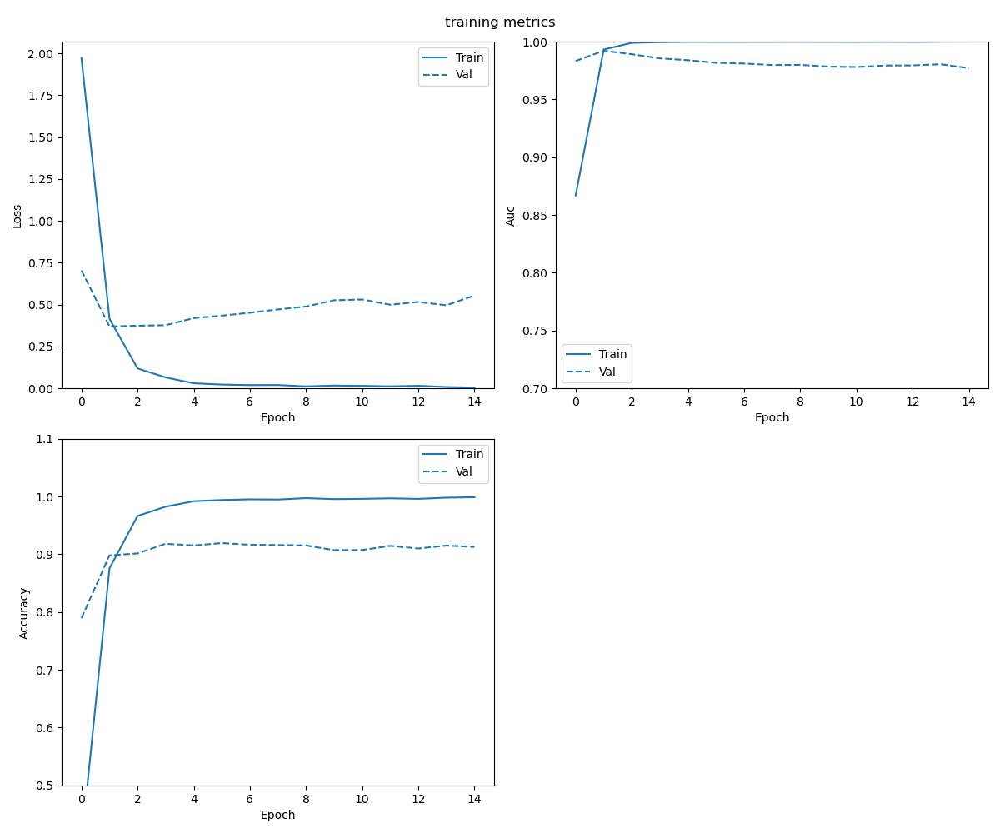

# Machine learning for biological sequences 
This repo is where I test develop/test/benchmark different machine leanring techniques for RNA sequences. Most of what I write here is for my ocular transriptome project, but I needed a way to test out ideas with a solved problems

For my final project I want to see if I can use deep learning methods to model and classify biological sequences, specifically RNA. My research project involves a lot of work with RNA sequences, so the results I get here will translate to my own work. This repo started as my final project for FAES's deep learning course, but I  


# BIOF509 Deep Learning for healthcare final report
## Motivation
RNA sequences or transcripts are the basis of gene expression and store an enormous amount of information. Reseachers have extracted some of that information through experiments, such as protein domains, and RNA binding protein motifs. A common task with RNA sequences is determining whether a transcript is protein coding, or noncoding. This is a relatively simple task and can determined to nearly 100% accuracy, because through years of research we have learned about codons and how exactly RNA is translated in to proteins. But Im curious to see how a model incorporating no prior biological knowledge will perform. This might especially be useful to because I want to try and use this for my own research, where I've been trying to classify potential novel gene isoforms as real or not.


## Previous Work in the field
After a little digging, there is a little bit previous work in the field. people have applied NLP techniques like embedding to generate low dimensional features for biological sequences, but almost everything is using protein sequences, and not nucleotide sequence. Most use some combination of Word2Vec or Doc2Vec, combined with a downstream machine learning model. As the ...2Vec models are unsuprevised, they likely provide a more general representation of sequence information, so Im curious to see how a supervised embedding will perform. Most of the work was in protein family classifation from protein sequence alone, and they got pretty good results, 90%> for binary classification, and 80>% for multiclass. Theres also a lot more work directly using the sequence by producing a sequence one hot encoded for each nucleotide to make a sequence vector.  This has been used in more the deep learning on sequence projects. and seems to work fairly well for a lot of tasks, so will probably try both. Hoo Chang thinks the sequence vector method is better because a lot of NLP methods were designed for natural language, and theres no proof biological sequence has a similar latent structure to natural language, but for this project Im focusing only on the embedding models.


## Proposed Strategy
Im going to make 2 different models

    1. The classic NLP model with Doc2Vec embedding + ml algorithmn. Doc2Vec generates a single vector for each sequence.This is going to be my point of comparison.
    
    2. An RNN that generates a supervised embedding

## Dataset
I extracted all protien famlies from the uniprot database, and selected families with at least 1000 associated proteins. I obtained the nucleotide sequene from the GenBank database. The data set contains 21 families across 42018 transcripts

```
G-protein coupled receptor 1 family                     6566
Class-II aminoacyl-tRNA synthetase family               4085
Cytochrome b family                                     3266
Class-I aminoacyl-tRNA synthetase family                3098
Cytochrome P450 family                                  2908
ATPase alpha/beta chains family                         2862
Heat shock protein 70 family                            1849
TRAFAC class translation factor GTPase superfamily      1513
Chaperonin (HSP60) family                               1370
HisA/HisF family                                        1344
Universal ribosomal protein uS7 family                  1312
Universal ribosomal protein uS4 family                  1273
Universal ribosomal protein uS12 family                 1260
Universal ribosomal protein uL16 family                 1245
Universal ribosomal protein uL2 family                  1239
MurCDEF family                                          1225
Universal ribosomal protein uS2 family                  1209
Universal ribosomal protein uS19 family                 1179
Universal ribosomal protein uS8 family                  1164
Universal ribosomal protein uL14 family                 1162
Globin family                                            888
```


  
 
## Data preprocessing
For the embedding models, I need to first convert RNA sequences into something that resembles language a little better. To do this Im going to use a fixed length window and slide along a transcript to generate kmers, where k is the window length . For example for the sequence ATGCATGC, the sequence  of 4mers would be {ATGC, TGCA, GCAT, CATG,ATGC, TGCA, GCAT, CATG}. I'll treat these kmers as words, and use them to generate the embedding. The choice of k is a hyperparameter, and determiend the vocabulary size for embedding model: VocabSize = 4^k

## Model Results 

### Doc2Vec Embedding
This model is a the floor/minimum possible score for the project, I expect the DL models to perform better than this. I used the gensim implementation of Doc2Vec, with the following hyper paramters:

- Training_algorithmn: PV-DM
- minimum_word_count: 30
- kmer_size: 8
- embedding_dimension:100
- Clasification was done with a random forest with 100 estimators, balanced class weights and remaining parameters as defaults

#### Results
```
              precision    recall  f1-score   support

           0       0.75      0.91      0.82      1313
           1       0.41      0.42      0.41       582
           2       0.48      0.51      0.50       572
           3       0.74      0.85      0.79       177
           4       0.62      0.32      0.42       370
           5       0.51      0.10      0.17       245
           6       0.80      0.43      0.56       274
           7       0.32      0.54      0.40       817
           8       0.36      0.20      0.26       620
           9       0.94      0.91      0.93       653
          10       0.76      0.48      0.59       303
          11       0.61      0.71      0.66       269
          12       0.59      0.59      0.59       232
          13       0.54      0.76      0.63       255
          14       0.56      0.54      0.55       233
          15       0.55      0.44      0.49       249
          16       0.66      0.64      0.65       248
          17       0.63      0.62      0.63       252
          18       0.73      0.80      0.76       236
          19       0.54      0.35      0.42       242
          20       0.59      0.58      0.58       262

    accuracy                           0.59      8404
   macro avg       0.60      0.56      0.56      8404
weighted avg       0.60      0.59      0.58      8404
```
Pretty bad, though when increasing kmer size the results to improve by about 10%. I'm going to keep the kmer size fixed at 8 tho because it will reduce training time for the nns. If i did some parameter tuning, it likely would do better.


### Embedding based RNN
All models are written in the keras api for tensorflow
#### Model
I kept it fairly simple, and after some tuning settled on a  Bi-LSTM with masking and 2 dense layers. Dropout used in each layers. The emebedding vocab size is all kmers that occur more than 30 times within the data set. Transcripts that had all kmers out of vocab were dropped(~3 transcripts)

Parameters
- Loss: categorical_crossentropy
- optimzer: Adam, default parameters
- LSTM activation : tanh 
- dense activation : relu
- kmer_size: 8

All other hyperparams are default

```
Model: "base_LSTM"
_________________________________________________________________
Layer (type)                 Output Shape              Param #   
=================================================================
embedding (Embedding)        (None, 8762, 128)         8388352   
_________________________________________________________________
bidirectional (Bidirectional (None, 256)               263168    
_________________________________________________________________
dense (Dense)                (None, 128)               32896     
_________________________________________________________________
dropout (Dropout)            (None, 128)               0         
_________________________________________________________________
dense_1 (Dense)              (None, 64)                8256      
_________________________________________________________________
dropout_1 (Dropout)          (None, 64)                0         
_________________________________________________________________
dense_2 (Dense)              (None, 21)                1365      
=================================================================
Total params: 8,694,037
Trainable params: 8,694,037
Non-trainable params: 0
```
#### Training
The model was trained distrbuted across 2 V100x gpus, using mixed precesion with a batch size of 512 and trained for 15 epochs
Training split: 80%
Validation split: 10%
Test split: 10%



Looks the model trained pretty well, and fit pretty quickly, with out hockey sticking

#### Results
Evaulating using the standard sklearn classification report
```
              precision    recall  f1-score   support

           0       0.92      0.98      0.95       657
           1       0.82      0.78      0.80       291
           2       0.83      0.86      0.84       286
           3       0.92      0.88      0.90        89
           4       0.98      0.93      0.95       185
           5       0.75      0.66      0.70       122
           6       0.99      0.88      0.93       137
           7       0.86      0.82      0.84       409
           8       0.76      0.90      0.83       310
           9       0.97      0.98      0.98       327
          10       0.93      0.93      0.93       152
          11       0.95      0.89      0.92       134
          12       0.97      0.93      0.95       116
          13       0.91      0.93      0.92       127
          14       0.97      0.96      0.96       116
          15       0.96      0.90      0.93       124
          16       0.90      0.92      0.91       124
          17       0.93      0.94      0.94       126
          18       0.94      0.92      0.93       118
          19       0.82      0.78      0.80       121
          20       0.99      0.95      0.97       131

    accuracy                           0.90      4202
   macro avg       0.91      0.89      0.90      4202
weighted avg       0.90      0.90      0.90      4202
```
So a pretty amazing increase in performance 

### Conclusion

Deeplearing methods designed for natural langauge can be applied to biological sequences with to a great degree of success. 


